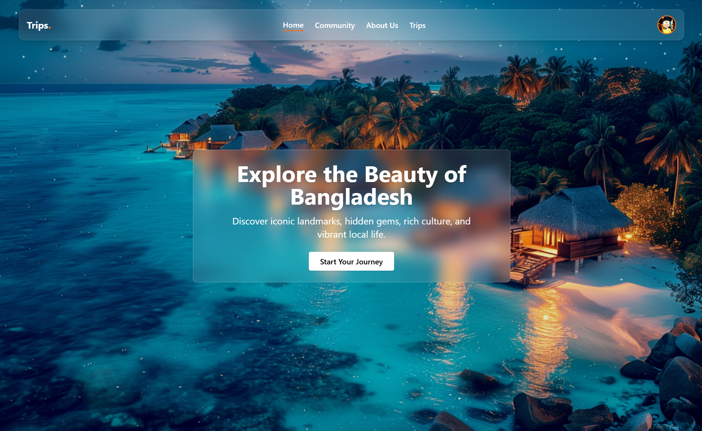

# 🌍 Trips — Explore Bangladesh with Guided Experiences

**Trips** is a full-featured travel booking platform built with React, TailwindCSS, and Node.js. It enables tourists to book tour packages, share travel stories, apply as tour guides, and manage personal or assigned tours. Admins can oversee the system with role-based dashboards and analytics.



---

## 🔗 Live Site

👉 **[Visit Live Site](https://travelbd-ea2e0.web.app/)**

---

## 🔐 Admin Credentials

- **Email:** `abcd@gmail.com`
- **Password:** `Rashik1212@`

---

## ✨ Key Features

- 🧳 **Tour Package Booking:** Tourists can browse and book travel packages with guide details and pricing.
- 🔐 **Authentication & Roles:** JWT-based login system with Tourist, Guide, and Admin roles.
- 📅 **My Bookings Page:** Users can view, pay for, or cancel their pending bookings.
- 💳 **Stripe Payment Integration:** Seamless and secure payment gateway.
- 🧾 **Invoice Tracking:** Payment history saved with transaction IDs and real-time updates.
- 🧑‍💼 **Tour Guide Application:** Tourists can apply to become tour guides; admins can review and accept/reject.
- 🧭 **Assigned Tours Panel:** Guides can view tours assigned to them, accept or reject with status updates.
- 📝 **Community Stories:** Users can post travel stories with multiple images; others can explore shared experiences.
- 🧠 **Admin Dashboard:** View analytics like total payments, guides, users, stories, and packages.
- 🧠 **Guide Dashboard:** Track assigned tours, posts, and total earnings (only from accepted tours).
- 🎉 **Confetti Celebration:** A congratulatory animation triggers when users book more than 3 tours.


---

## 📂 Tech Stack

**Frontend:**

- React + React Router
- TailwindCSS
- Axios + React Query
- Framer Motion + GSAP
- SweetAlert2
- React Select
- Stripe.js
- React Confetti

**Backend:**

- Node.js + Express
- MongoDB
- JWT (jsonwebtoken)
- Stripe Payment API
- Role-based Access Control
- Secure routes with token verification

**Deployment:**

- Frontend: firebase
- Backend: vercel

---

## 📸 Preview Image

> Save your screenshot as:  
> `/public/travelbd-preview.jpg`  
> and it will appear above.

---

## 🚀 How to Run Locally

```bash
# Clone frontend
git clone https://github.com/rashikdev/travelbd-frontend.git
cd travelbd-frontend

# Install dependencies
npm install

# Start the development server
npm run dev
```

## 🧑‍💻 Author

**Md. Rashik** — [GitHub](https://github.com/rashikdev) | [LinkedIn](https://linkedin.com/in/rashikdev)